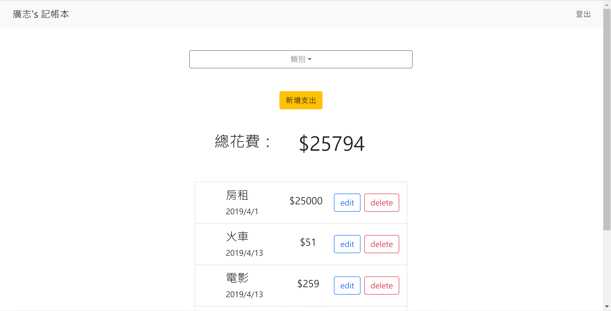

# 我的記帳本



## 介紹

可以透過 google、facebook 或是自行建立帳號登入，
擁有一個簡易記帳的應用程式。

### 功能

- 註冊帳號登入後，使用記帳功能
- 記錄新的一筆帳目、且能編輯及刪除
- 首頁能看到所有帳目及花費總金額
- 首頁能篩選帳目的類別進行瀏覽

## 開始使用

1. 請先確認有安裝 node.js 與 npm
2. 將專案 clone 到本地
3. 在本地開啟之後，透過終端機進入資料夾，輸入：

   ```bash
   npm install
   ```

4. 安裝完畢後，繼續輸入：

   ```bash
   npm run seed
   ```

5. 若看見「done」表示種子資料下載完畢，繼續輸入：

   ```bash
   npm run start
   ```

6. 若看見此行訊息則代表順利運行，打開瀏覽器進入到網址 http://localhost:3000

   ```bash
   running on localhost:3000
   ```

7. 若欲暫停使用

   ```bash
   ctrl + c
   ```

8. 測試帳號及密碼：
   ```bash
   email: user1@example.com
   password: 123456789
   ```

## 開發工具

- Node.js 18.16.0
- Express 4.18.2
- Express-Handlebars 3.0.0
- body-parser 1.20.2
- bcryptjs2.4.3
- connect-flash 0.1.1
- dotenv 8.2.0
- express-session 1.17.3
- method-override 3.0.0
- mongoose 5.9.7
- nodemon 3.0.1
- passport 0.4.1
- passport-facebook 3.0.0
- passport-google-oauth20 2.0.0
- passport-local 1.0.0
